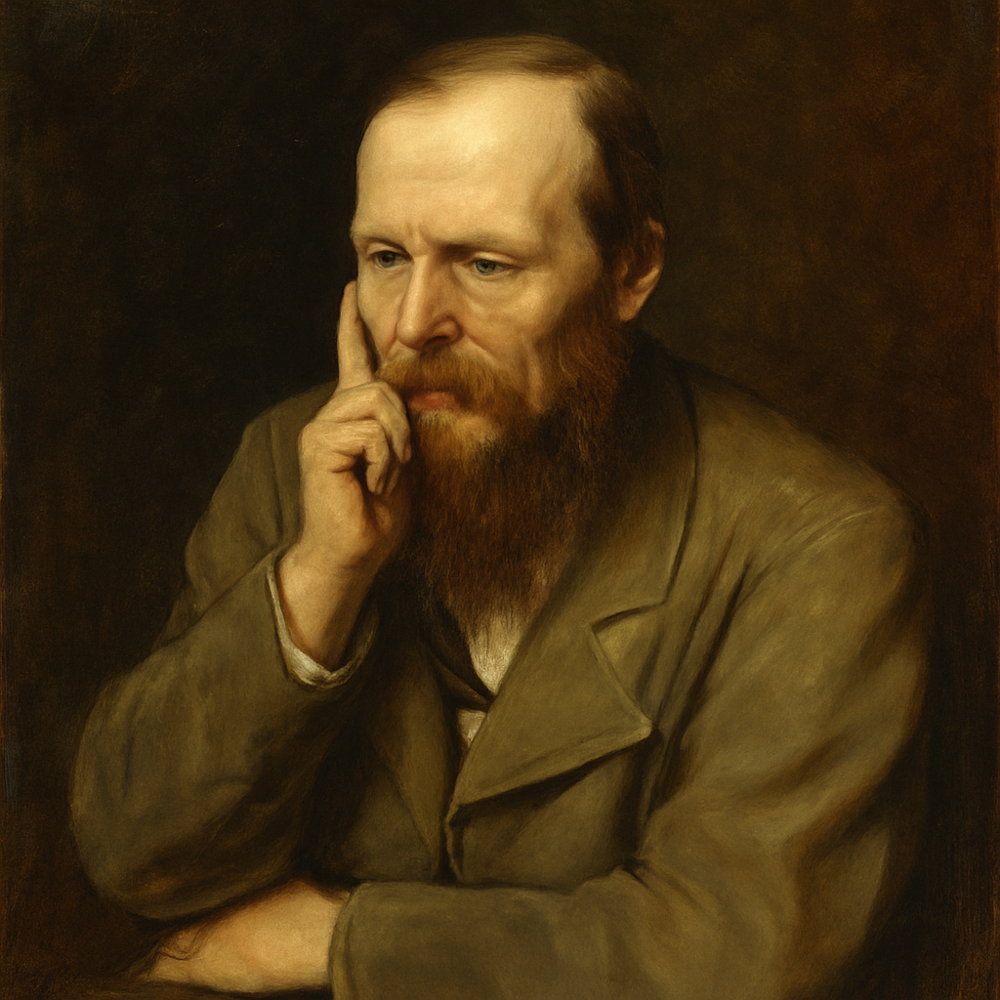
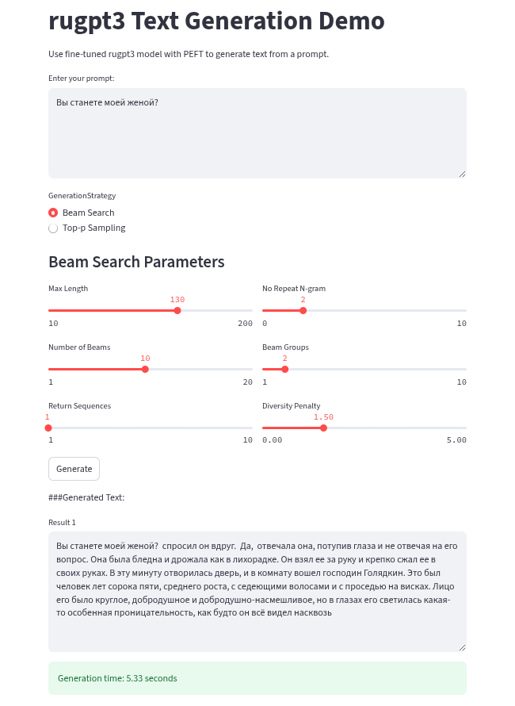

# Russian AI Poetry Generator with Dostoevsky Style🤍💙❤️



This project fine-tunes a [rugpt3](https://arxiv.org/abs/2309.10931) model using [Dostoevsky's literary corpus](https://gitlab.com/z00logist/artificial-dostoevsky/-/raw/main/data/corpus.txt) to generate poetic text in the distinctive style of the classic Russian author. The solution implements Parameter-Efficient Fine-Tuning (PEFT) with LoRA to adapt the large language model while maintaining computational efficiency.

## Key Features ✨

- **Dostoevsky-style text generation** - Trained on authentic literary corpus
- **Efficient fine-tuning** - Uses LoRA (Low-Rank Adaptation) for parameter-efficient training
- **Streamlit web interface** - User-friendly interface for text generation
- **Multiple generation strategies** - Beam search and top-p sampling options
- **GPU-accelerated** - Optimized for NVIDIA GPUs

## Technical Implementation 🧠

### Model Architecture
- **Base Model**: [`ai-forever/rugpt3large_based_on_gpt2`](https://gitlab.com/z00logist/artificial-dostoevsky/-/raw/main/data/corpus.txt)
- **Fine-tuning Method**: LoRA (Low-Rank Adaptation)
- **LoRA Parameters**:
  - Rank: 16
  - Alpha: 32
  - Target Modules: `c_attn`, `c_proj`
  - Dropout: 0.05

## Training Details 🧠

### Dataset Preparation
The model was fine-tuned on Dostoevsky's literary corpus (9.65M characters) using the following preprocessing pipeline:

1. **Corpus Chunking**:
   - Original text divided into 10,000 character documents
   - 965 documents created from full corpus
   - 80/10/10 split for train/validation/test sets

2. **Tokenization**:
   - Using `ai-forever/rugpt3large_based_on_gpt2` tokenizer
   - Special tokens preserved (EOS token used as padding token)
   - Average document length: ~2500 tokens

3. **Sequence Chunking**:
   - Final chunk size: 1024 tokens
   - Training uses streaming chunks with random sampling
   - Validation/test use fixed sequential chunks
   - Dynamic attention masking during training

### LoRA Configuration
- **Rank**: 16
- **Alpha**: 32 (alpha/rank ≈ 2)
- **Target Modules**: `c_attn`, `c_proj`
- **Dropout**: 0.05
- **Task Type**: Causal Language Modeling
- **Trainable Parameters**: 6.5M (0.85% of total 767M parameters)

### Training Parameters
| Parameter | Value | Description |
|-----------|-------|-------------|
| **Batch Size** | 4 | Per-device training batch size |
| **Accumulation** | 8 | Gradient accumulation steps |
| **Effective Batch** | 32 | Total batch size after accumulation |
| **Learning Rate** | 2e-4 | Initial learning rate |
| **Optimizer** | Paged AdamW 8-bit | Memory-efficient optimizer |
| **Precision** | FP16 | Mixed-precision training |
| **Scheduler** | Cosine | Learning rate schedule |
| **Max Steps** | 50 | Training iterations |
| **Max Grad Norm** | 0.5 | Gradient clipping threshold |

### Memory Optimization
- **8-bit Quantization**: Reduced model memory footprint
- **Gradient Checkpointing**: Trade compute for memory
- **Iterable Dataset**: On-the-fly chunk streaming
- **Paged Optimizer**: Prevent memory spikes during updates

### Hardware Configuration
- Single NVIDIA RTX A4000 (16GB VRAM)

## How to Use 🚀

### Web Interface
Run the Streamlit app for interactive text generation:
```bash
streamlit run app.py
```



### Generation Options
1. **Beam Search**:
   - Control beam width and diversity
   - Prevent n-gram repetition
   - Generate multiple variants

2. **Top-p Sampling**:
   - Adjust temperature for creativity control
   - Set probability threshold for nucleus sampling
   - Fine-tune output randomness

### Code Generation Example
```python
from transformers import AutoModelForCausalLM, AutoTokenizer

device = torch.device("cuda:0" if torch.cuda.is_available() else "cpu")
checkpoint = 'checkpoint-1200'
model = AutoModelForCausalLM.from_pretrained(checkpoint).to(device)

tokenizer = AutoTokenizer.from_pretrained(checkpoint)

inputs = tokenizer("Быть или не быть?", return_tensors="pt").to(device)
outputs = model.generate(
    input_ids=inputs["input_ids"],
    attention_mask=inputs["attention_mask"],
    max_length=100,
    num_beams=10,
    no_repeat_ngram_size=2,
    num_beam_groups=2,
    diversity_penalty=1.5
)

generated_texts = [tokenizer.decode(output, skip_special_tokens=True) for output in outputs]
print(generated_texts[0])
```

## Installation ⚙️

1. Clone repository:
```bash
git clone https://github.com/Ansarill/poetry.git
cd poetry
```
2. Create virtual env (**Python 3.10.12**):
```bash
python3.10 -m venv my_env
source my_env/bin/activate
```
3. Install dependencies:
```bash
pip install -r requirements.txt
```

## Results Example 📜

**Prompt**:  
"Быть или не быть?"

**Generated Output**:  
Быть или не быть? Вот вопрос, на который я не мог найти никакого ответа. Я не знал, что мне делать и как мне быть. Наконец я решился и пошел к Наташе. Она сидела одна и читала книгу. Увидев меня, она тотчас же встала со стула и подошла ко мне.  Что с вами? Вы нездоровы?  спросила она, смотря на меня с каким-то беспокойством и в то же время как будто с удивлением,  я думала, вы больны.

## File Structure 📂
```
├── app.py                  - Streamlit web application
├── fine-tune lora ru.ipynb - Jupyter notebook with full training code
├── corpus.txt              - Dostoevsky's literary corpus
├── requirements.txt        - Python dependencies
├── checkpoint-50/          - Trained model checkpoint (50 steps)
└── checkpoint-1200/        - Trained model checkpoint (1200 steps)
```

## License 📄
This project is licensed under the Apache License, Version 2.0 - see the [LICENSE](LICENSE) file for details.

---
**Inspired by** the literary genius of Fyodor Dostoevsky  
**Powered by** Hugging Face Transformers and PEFT libraries